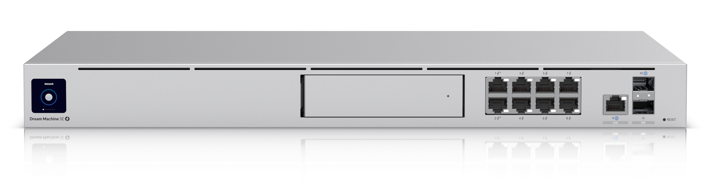
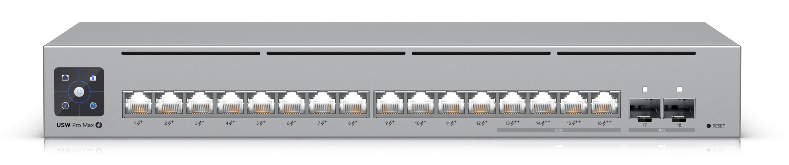
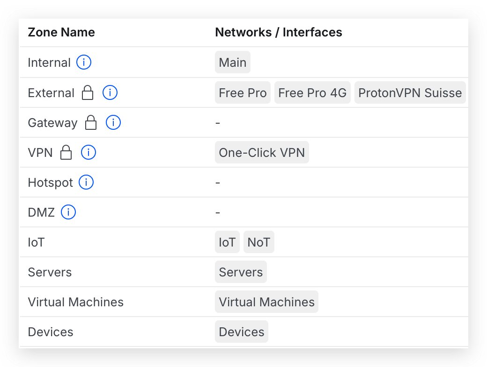

Je pense que le réseau est la pierre angulaire de tout Homelab qui se respecte. Pas besoin de choses overkill juste pour héberger quelques services, mais dès lors que l'IOT s'invite à la fête, il vaut mieux avoir quelque chose de solide.

Je suis parti sur Unifi, car je ne suis pas un pro du réseau et je voulais quelque chose qui fonctionne bien, qui permette un contrôle fin de mon réseau tout en me prenant par la main pour sa configuration. En plus, la partie Camera me tentait bien !

== Hardware

=== link:https://eu.store.ui.com/eu/en/category/cloud-gateways-large-scale/products/udm-se[Unifi Dream Machine SE^]

Ou UDM pour les intimes. C'est le centre névralgique du réseau. C'est une passerelle tout-en-un au format rack 1U qui fait office de routeur, de pare-feu, de switch PoE et même de NVR (enregistreur vidéo réseau) pour les caméras Unifi Protect.

Côté performances, on parle d'un routage avec la stack de sécurité qui supporte un débit de ~5 Gbps pour ma configuration. Autant dire que même en activant toutes les protections réseau, ça ne bronche pas.

Ce qui m'a particulièrement séduit, c'est la connectique :

- *8 ports LAN 1 GbE RJ45* dont 6 ports PoE 15W et 2 ports PoE+ 30W (130W au total) — parfait pour alimenter des access points et caméras sans câbles d'alimentation supplémentaires
- *2 ports LAN 10G SFP+* — pour les liaisons rapides avec ma Freebox pro et un switch principal

Le tout est géré via l'interface UniFi OS qui centralise la gestion du réseau, des caméras, du contrôle d'accès... C'est propre, c'est intuitif, et ça donne accès à l'ensemble de la suite applicative Unifi (Network, Protect et Connect).

Au départ, j'ai choisi ce matos car il permettait effectivement d'avoir suffisamment de ports en PoE+ pour mettre deux points d'accès et assez d'autres ports pour mes besoins. Je prévoyais aussi l'arrivée de la fibre, ainsi qu'éventuellement rajouter du matos sur le port SFP. Ce qui n'a pas manqué...

=== link:https://eu.store.ui.com/eu/en/category/all-switching/products/usw-pro-max-16-poe[USW Pro Max 16 PoE^]

Quand on commence à brancher des équipements un peu partout, les 8 ports du UDM SE ne suffisent plus. C'est là que ce switch entre en jeu. Le USW Pro Max 16 PoE est un switch managé au format rack 1U qui vient compléter l'infrastructure avec 16 ports supplémentaires et surtout du PoE++ pour les équipements les plus gourmands. Là, je devrais être bulletproof pour le futur.

Côté connectique, c'est bien fourni :

- *12 ports 1 GbE RJ45* avec PoE+ (30W par port) — pour les access points, caméras et autres équipements classiques
- *4 ports 2.5 GbE RJ45* avec PoE++ (60W par port) — pour les équipements nécessitant plus de bande passante ou de puissance, comme des access points WiFi 7
- *2 ports 10G SFP+* — pour les uplinks vers le UDM SE ou d'autres switches

Le petit plus sympa, c'est l'Etherlighting : chaque port s'illumine pour indiquer son état (vitesse de liaison, VLAN natif...). C'est gadget, mais en pratique c'est super utile pour diagnostiquer un problème de câblage d'un coup d'œil dans le rack. Je suis pas très RGB d'habitude, mais je dois avouer que ça fait son petit effet !

=== Autres

Pour la partie réseau filaire, j'ai quelques petits link:https://eu.store.ui.com/eu/en/category/switching-utility/products/usw-flex-mini[USW Flex Mini^] ça et là pour de l'appoint. Par exemple, mon meuble télévision n'a pas besoin de hautes vitesses, donc pour connecter l'Apple TV, la Switch et d'autres appareils, c'est suffisant.

Pour la partie réseau sans fil, j'ai plusieurs points d'accès. Je suis obligé d'en avoir au moins 3 ou 4 pour avoir une couverture acceptable dans ma maison à cause de ses énormes murs en terre de 60cm d'épaisseur. Aucun WiFi ne saurait traverser ça sereinement ! Comme la maison a été bâtie autour de ces murs en terre, j'ai donc 3 zones à couvrir en intérieur, une large zone en extérieur.

== La Configuration Générale

Ça, c'est le nerf de la guerre. C'est là qu'on peaufine tout et que mon attrait pour la bidouille prend tout son sens. C'est sympa de monter un rack, mais c'est encore plus satisfaisant de le paramétrer !

=== Internet

J'ai une fibre Free Pro de 8 Gbps symétrique. Toutefois, je n'utiliserai jamais plus de 5 Gbps car les couches de sécurité de mon UDM limitent le débit en analysant les paquets. C'est un bottleneck que je trouve acceptable pour mon utilisation.

Je suis obligé d'utiliser la Freebox Pro car brancher la fibre directement dans le port fibre de la UDM ne fonctionne pas. Probablement une authentification propriétaire, dans tous les cas le support ne m'a pas aidé à me passer de leur box. Un câble SFP+ relie donc mon UDM à ma Freebox Pro.

J'ai en plus un modem 4G de backup si jamais la connexion principale est down.

Enfin, j'ai un client link:https://protonvpn.com[ProtonVPN^] pour router une partie du trafic dans un tunnel chiffré. Je l'utilise principalement pour anonymiser certaines connexions.

=== VLAN

Tout s'axe autour des VLAN qui sont des réseaux virtuels sur lesquels les appareils se connectent. +
Généralement, on utilise les VLAN pour cloisonner le réseau en fonction des appareils. Voici les miens :

- **Main** : Correspond au par défaut, sans restriction. Je ne suis pas sûr que ce soit une très bonne pratique de le garder comme tel. Il sert aux appareils réseaux de Unifi.
- **Devices** : Tous les appareils comme les téléphones, ordinateurs et les invités. Par défaut, le réseau est cloisonné et les appareils ne peuvent parler à aucun autre appareil sur le réseau.
- **Servers** : Le nom est plutôt explicite. Généralement ce sont des appareils qui sont statiques et ne sont pas voués à être offline.
- **Virtual Machines** : Les machines virtuelles utilisent ce réseau qui par défaut est isolé.
- **IoT** : Tous les appareils IoT. Par défaut, les appareils ne devraient pas avoir accès à internet, et ont tous accès à ma centrale domotique.

[NOTE]
====
Un dernier VLAN nommé NoT est présent actuellement mais voué à disparaître. Les appareils IoT ont actuellement accès à internet, et les NoT non. À terme, je vais refuser l'accès à tous par défaut, puis autoriser certains domaines au cas par cas. Le VLAN IoT actuel est donc trop laxiste.
====

=== WiFi

En vrai c'est plutôt anecdotique. Il y a deux réseaux à savoir un commun qui envoie dans le VLAN `Devices`, et un autre, caché, dédié aux appareils IoT, qui envoie dans le VLAN `IoT`.

Je réserve le 2.4GHz pour les appareils legacy, et le 5GHz pour les appareils qui le supportent.

== Firewall

Disons-le, c'est la partie sécurité la plus importante. C'est ici qu'on autorise ou non un paquet à faire son petit bonhomme de chemin sur notre réseau, à un appareil de contacter un autre.

=== Les Objets

Les règles "objets" servent à viser un réseau ou un appareil spécifique et lui donner des règles simples, prioritaires par rapport aux autres règles. Le contrôle que l'on peut avoir sur la configuration est assez limité ici, donc je ne l'utilise que pour des règles simples.

- Une règle visant le réseau `Devices` qui route certains domaines sur la partie VPN.
- L'objet réseau HomeAssistant qui a le droit de contacter tout le VLAN IoT.
- Certains appareils ont 100% de leur trafic routé vers le VPN.

=== Les Zones

Un bon schéma vaut mieux qu'un long discours, voici un screenshot du mapping des VLAN sur mon réseau :

Je vais maintenant trier les règles par zone source. Concrètement, c'est surtout trois zones qui sont importantes : IoT, Devices et Servers. La partie Virtual Machines est au cas par cas et souvent éphémère.

Pour le tableau suivant, on parle des privilèges qu'ont les appareils IoT sur le réseau. Comme ces appareils sont très variés et sont sur une zone volontairement restrictive, il y a beaucoup de règles précises.

[cols="6*", options="header"]
|===
| Nom                      | Zone Src | Src          | Zone Dest | Dest          | Description
| AirPlay -> AirPlay       | IoT         | AirPlay Devices | IoT              | AirPlay Devices      | Permet aux appareils supportant AirPlay à échanger
| HomeKit Bridge -> Camera | IoT         | Apple TV        | IoT              | Camera               | Permet à l'Apple TV de se connecter directement aux caméras
| IoT -> HomeAssistant     | IoT         | *               | Servers          | HomeAssistant        | Permet à tous les appareils IoT de dialoguer librement avec HomeAssistant
| IoT -> NTP               | IoT         | *               | External         | Domaines spécifiques | Permet à tous les appareils de contacter des serveurs NTP pour l'heure
| TV -> Multimedia Server  | IoT         | Télévisions     | Servers          | NAS                  | Permet à mes télévisions d'accéder aux services du NAS
|===

Les appareils de la zone `Devices` doivent supporter le moins de friction possible malgré une zone très restrictive. En effet, on ne souhaiterait pas que quelqu'un râle car il n'arrive pas à utiliser le AirPlay alors que c'est censé marcher, et accuser à raison mes "bidouilles" qui sont inutiles selon eux. Aussi, de la même manière, on expose petit à petit des droits sélectionnés avec soin.

[cols="6*", options="header"]
|===
| Nom                        | Zone Src | Src        | Zone Dest | Dest   | Description
| Devices -> HomeAssistant   | Devices     | *             | Servers          | HomeAssistant | Permet à tous les appareils de contacter les services de HomeAssistant
| Devices -> Printer         | Devices     | *             | IoT              | Imprimantes   | Permet à tous les appareils d'imprimer/scanner
| Devices -> HomeLab HTTP(S) | Devices     | *             | Servers          | HomeLab       | Permet à tous les appareils d'accéder aux services Web de mon HomeLab
| Devices -> AirPlay         | Devices     | *             | IoT              | AirPlay       | Permet à tous les appareils d'accéder aux services AirPlay
| Nover Devices -> IoT       | Devices     | Nover Devices | IoT              | *             | Activé à l'occasion de maintenance
| Nover Devices -> Server    | Devices     | Nover Devices | Servers          | *             | Activé à l'occasion de maintenance
| Nover Devices -> VM        | Devices     | Nover Devices | Virtual Machines | *             | Activé à l'occasion de maintenance
|===

== Conclusion

Ce réseau comprend quelques subtilités que j'ai passées sous silence pour ne pas rendre plus verbeux un article déjà long. De plus, souvent ces "subtilités" sont dues à une mauvaise abstraction et pourraient être résolues par un meilleur regroupement des appareils ou des règles plus générales.

Je trouve ma configuration plutôt robuste, même si j'y retourne occasionnellement pour peaufiner certaines choses. Par exemple, j'ai eu à utiliser le logiciel AudioRelay entre une VM et mon ordinateur, qui se trouvent sur 2 VLAN différents. Cela a donné lieu à des configurations spécifiques, mais qui n'ont pas grand intérêt à détailler ici.
