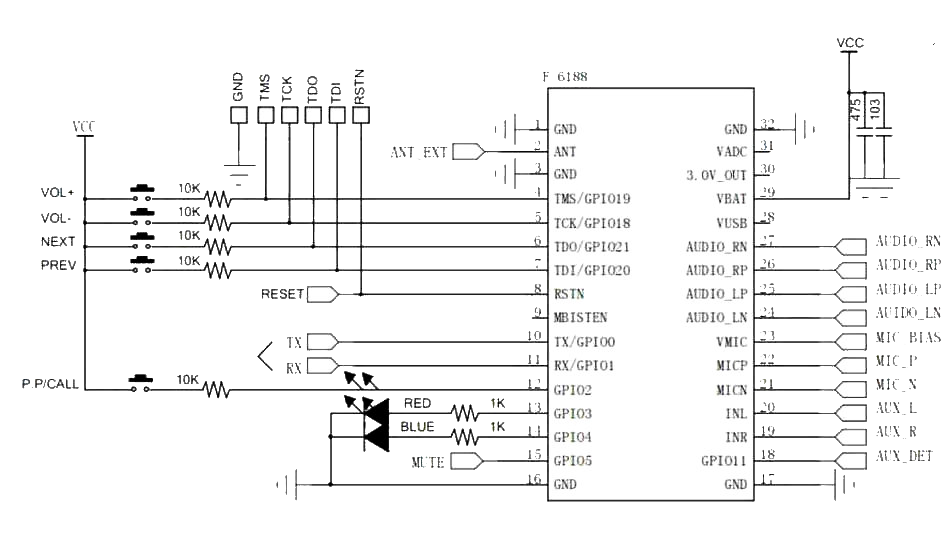
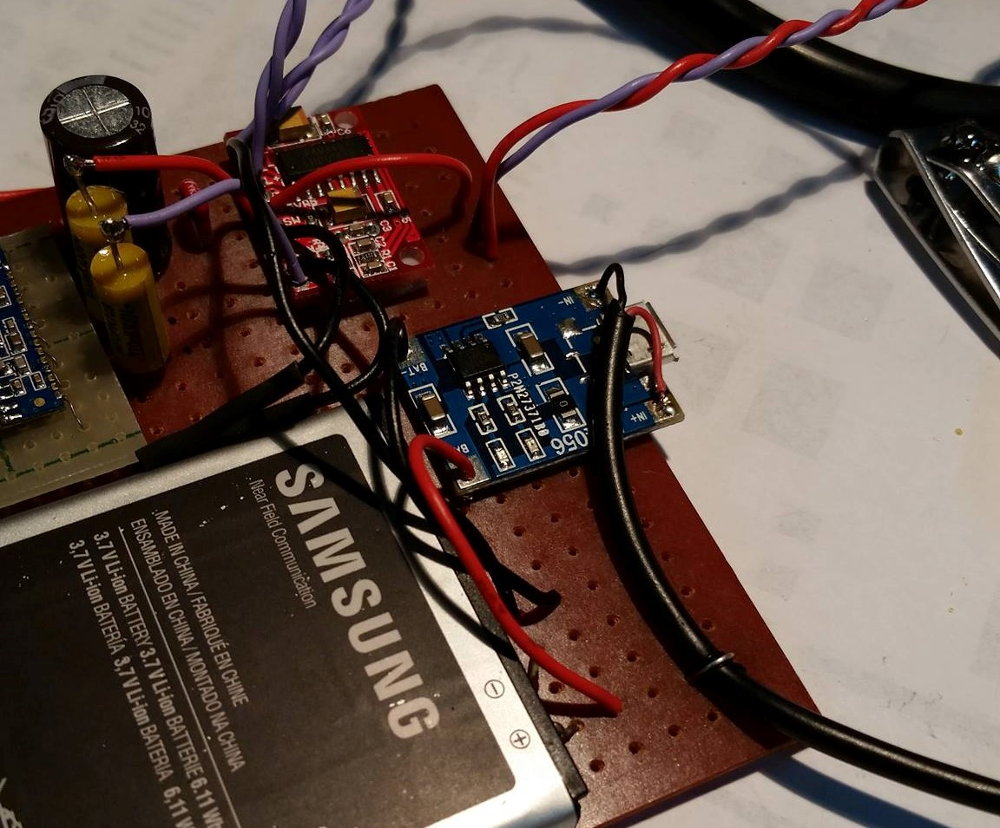
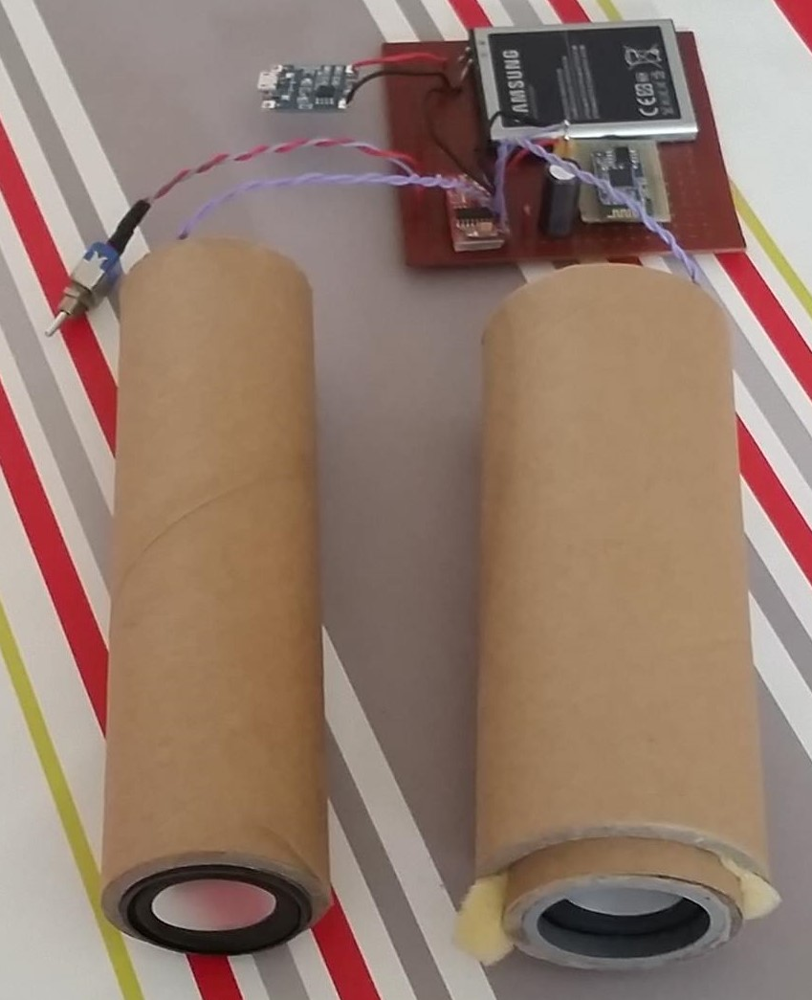
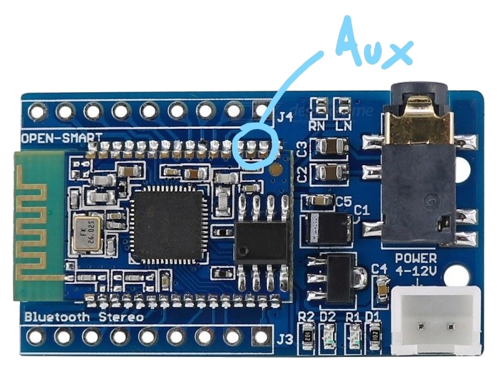

Douglas est une enceinte Bluetooth Low-Cost. Une batterie pour portable recyclée, à peu près 15€ de l'huile de coude et vous voilà avec un objet essentiel pour toute sortie entre amis.
Pourquoi l'ourson ? Parce que c'est mignon, ça protège bien le matériel qu'il y a dedans et que c'est original.

Douglas est fonctionnel, mais toujours en développement. En effet, je souhaite y apporter quelques fonctionnalités comme la visualisation de la charge de la batterie, le réveil de l'enceinte sans besoin de bouton physique (hormis pour l'appairage).

# Version 1

Douglas a surtout pour principe de ne pas couter cher en achetant le minimum possible. Ainsi, seuls les objets ayant un lien dans la liste suivante ont été acheté, le reste étant de la récupération.

 - Une batterie Li-Ion
 - Un amplificateur symétrique
 - Deux haut-parleurs 3W
 - Un circuit de charge pour batterie Li-Ion
 - Un module Bluetooth A2DP (le BK800L)
 - Des résistances de 10kΩ, de des boutons poussoirs
 - Des fils, de l'étain et un fer à souder
 - Une plaquette pour souder

On en a en tout pour une 15aine d'euros, on s'en sort donc pas trop mal. Il reste maintenant à souder tous les composants ensembles afin que tout fonctionne correctement.

Les choses sérieuses arrivent et il faudra être bien concentré pour la suite des évènements. En effet, le module Bluetooth est un enfer à souder pour peu qu'on n'ai ni fil à wrapper, ni un fer à souder digne de ce nom... J'ai donc fait au possible.
J'ai dénudé un fil multibrin pour découper des brins de longueur 3cm. J'ai ensuite soudé chaque brin sur les cosses du module. C'est fastidieux et ça a tendance à déconner. Le meilleur aurait de faire un PCB, mais quand on a pas le matériel, on se débrouille quand même !

Je n'ai pas utilisé toutes les pins mais seulement les suivantes : 1, 2, 4, 5, 6, 7, 12, 16, 17, 25, 26, 29, 32.

J'ai préféré relier toutes les masses (GND sur le schéma) à la masse pour éviter au maximum les interférences. Je ne sais pas si c'est utile, mais ça me rassure. De plus, je n'ai choisi que les pins qui m'intéressaient à savoir les boutons, le son et l'alimentation. On peut très bien utiliser les pins Rx/Tx pour renommer le module Bluetooth par exemple (et remplacer cet affreux nom "BK8000L").

Place maintenant au montage sur la carte. On prend une petite carte qui acceptera tous les composants.
On colle dans un premier temps la batterie sur le circuit. Ensuite, on soude un à un les composants comme le stipule le schéma suivant :

Assurez vous que les soudures soient bien faites afin de ne pas avoir de mauvaises surprises. De plus, prenez garde au soudage du module Bluetooth qui est extrêmement fastidieux compte tenu des petits espaces disponibles, d'où l'utilité des fils à wrapper.

Cela donne le résultat suivant. Vous avez théoriquement 4 fils non-reliés qui sont dédiés aux speakers. J'ai mis un fil supplémentaire qui est un câble USB directement soudé aux bornes du circuit de charge. J'ai donc un port femelle micro-USB ou un câble USB mâle sortant pour recharger facilement.

Pour les enceintes, il a fallu faire 2 caisses de résonnance adaptée aux haut-parleurs et aux dimensions de mon ourson. J'ai pris des tubes en carton trouvés par-ci par-là. A vous d'adapter comme vous le voulez ou pouvez afin d'avoir une bonne caisse de résonnance. Il n'y a pas de règle particulière si ce n'est que de bien fixer les HP pour éviter toute fuite d'air ou vibration.

# Pour une prochaine version

Douglas v1 souffrait de quelques petits problèmes ergonomiques.

 - Quand quelqu'un le serrait dans ses bras (ce qui arrivait souvent), cela pouvait appuyer sur le bouton situé au niveau du ventre. Un appui long redémarre le module ce qui est frustrant lorsque de la musique est en route.
 - Les boutons pour changer de chanson n'étaient quasiment jamais utilisés.
 - Les boutons volumes seraient souhaitables mais pourraient ne pas être utilisés.
 - Changer le volume sur le module s'effectue localement. Hors on pourrait souhaiter qu'un changement de volume sur Douglas se transmette au Smartphone afin que le volume s'actualise sur ce dernier.
 - Le circuit de charge n'est pas facile d'accès.
 - La carte en elle même n'est pas prévue pour une longue durée de vie, vu les soudures.

Ce sont des petits problèmes qui n'en sont pas. Je pinaille, mais c'est suffisant pour se lancer dans une version 2 qui pourrait résoudre certains de ces problèmes !

De plus, j'aimerai bien passer pour la version 2 sur du 5W afin d'avoir plus de puissance.

Autre chose qui m'embête, c'est le nom du module Bluetooth. En effet, il diffuse le nom "BK8000L". Ce serait super chouette de pouvoir le modifier en Douglas par exemple.

Un petit plus serait aussi de pouvoir rediriger le son vers une sortie jack. J'ai pensé à ça quand il y a une petite sono sans bluetooth, et qu'on souhaite quand même profiter du sans fil sans installation bancale.

De la même manière, pouvoir brancher un câble Jack dans Douglas pour bénificier de ses haut-parleurs pourrait être sympathique. Dans le module ci-dessus du moins, les ports Aux_L et Aux_R (20 et 19) ne sont malheureusement pas déportés. Si nous voulons les utiliser, il faudra souder deux fils sur la carte ce qui peut s'avérer laborieux et dangereux pour la carte.

Enfin, je souhaiterai oublier les petites batteries Li-Ion si possible. En effet, dans une des enceintes que j'avais conçu, l'une d'elle avait gonflé et comme elles ne sont pas protégées, je ne suis pas rassurer.

Je préfère utiliser des batteries externes car elles sont généralement protégées par un boitier, et ont une bien plus grande capacité.
