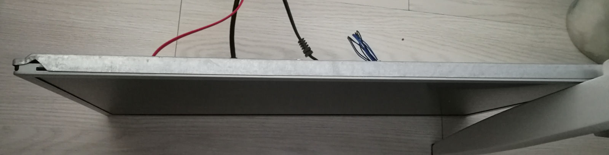
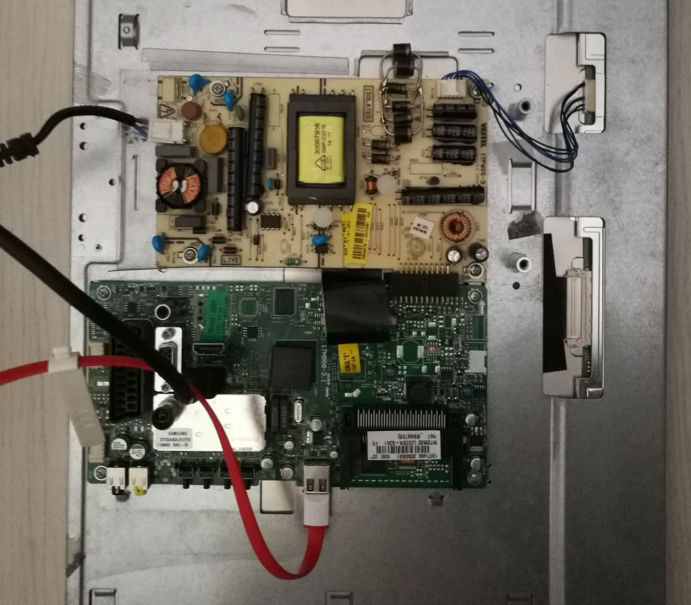
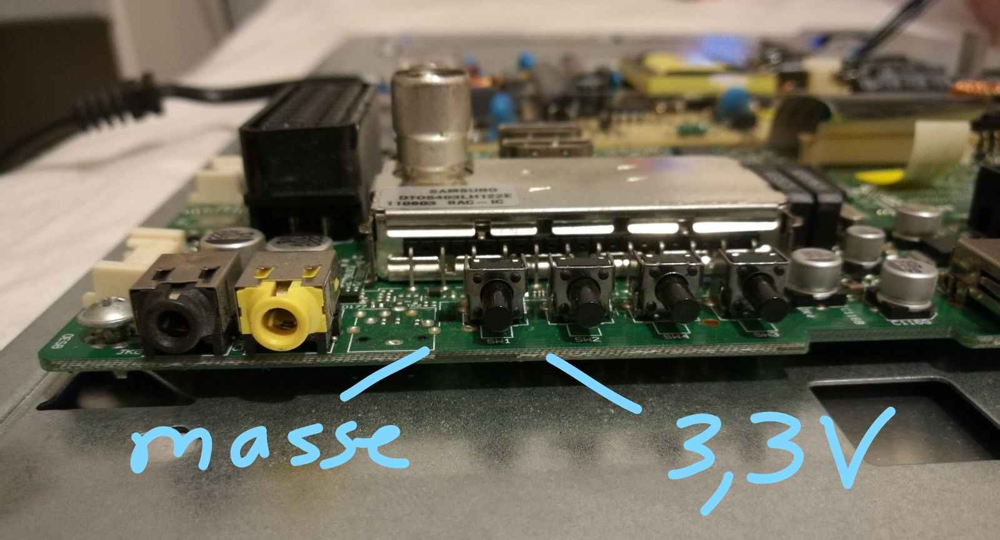
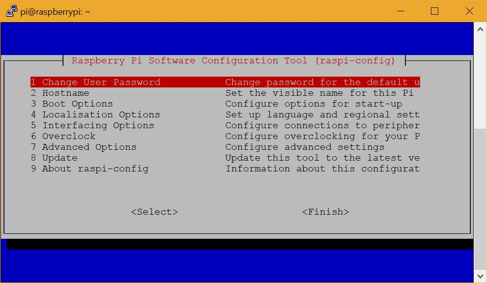
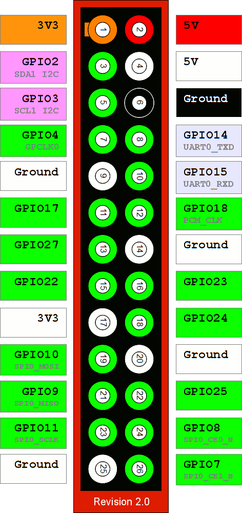

Le miroir intelligent est une petite interface qui devrait, le matin et le soir (ou à vrai dire, à chaque fois que vous allez dans la salle de bain), vous donner des informations pertinentes.

Le but est de se dispenser de vérifier son Smartphone en affichant les choses à faire dans la journée, la météo et quelques news. Et dans un soucis d'ergonomie, pas besoin d'un bouton pour l'activer : un capteur de proximité se chargera de le réveiller quand vous le regardez.

Pour l'instant, le projet n'en est qu'à un stade de prototype non fini. Il n'est toutefois pas abandonné.
Après l'achèvement des premières fonctionnalités, le travail suivant sera d'implémenter une reconnaissance vocale.

== Matériel

Mirint regroupe différents appareils "recyclés" : ils ne servaient plus, donc je me suis servi.

- Ecran de télévision LCD
- Raspberry Pi 2 et son alimentation
- Câble HDMI
- Un coffret
- Un film miroir sans teint
- Une plaque de plexiglas
- Du fil et de quoi souder

La première étape a été de dépioter le téléviseur. Afin que le miroir soit le plus fin possible, il faut enlever toute la partie protection plastique pour ne garder que la dalle et les circuits du téléviseur qui se divisent souvent en deux parties : un circuit d'alimentation où on relit l'appareil au secteur et un circuit d'entrées/sorties où vous branchez HDMI etc.

Il est important de **ne pas toucher le circuit d'alimentation** quand le système est sous tension ! Il y a risque d'électrisation voire électrocution !

Le Raspberry Pi est relié donc en HDMI au téléviseur. On pourrait auto-alimenter le RPi grâce au port USB du téléviseur, mais il sera tributaire de sa puissance. De plus, si le téléviseur est éteint, il y a de grandes chances que sur la plus part des téléviseur, le port USB soit désactivé. On opte donc pour une alimentation séparée.

Le coffret a été raboté afin de pouvoir placer le téléviseur sur ses rebords et donc avoir la dalle sur le même plan horizontal que les bords du coffret. Il faudra aussi faire en sorte que ces mêmes bords ainsi que ceux du téléviseur soient noirs (peinture ou scotch noir).

La plaque de plexiglas a été découpée avec les dimensions extérieures du coffret afin qu'elle couvre toute la surface.

Le film miroir a été collé sur la surface qui sera vers l'intérieur du coffret afin d'éviter toute dégradation et rentrée de lumière. Pour le mettre en place :

1. Bien laver le plexiglas,
2. Mettre de l'eau savoneuse sur la surface à coller,
3. Enlever le film protecteur du revêtement miroir,
4. Placer le film progressivement sur la surface en raclant avec une carte afin de chasser les bulles d'air
5. Une fois placé et bien seché, couper l'excédent de film

Pour ma part, j'ai percé puis fraisé le plexiglas pour le visser sur le coffret.

Par ailleurs, on veut pouvoir allumer le téléviseur sans appuyer physiquement sur le bouton "Allumer" car ça contraint à démonter le miroir à chaque fois. Ainsi, on regarde la tension appliquée aux bornes de ce bouton poussoir. Généralement, il y a 4 pattes donc pour peut vérifier avec deux bornes en diagonale.

Une fois trouvé (pour ma part 3,3V), on soude deux fils : un qui ira à la masse du Raspberry Pi et l'autre à un de ses nombreux GPIO, j'ai choisi le n°7. Pour voir la partie logicielle, rendez vous un peu plus bas au paragraphe "Contrôle du téléviseur".

== Logiciel

**La partie logicielle est obsolète, puisque maintenant il y a https://magicmirror.builders/[MagicMirror^] qui propose de faire tout ce que j'ai pu proposer.**

Dans un premier temps, veillez à bien configurer votre téléviseur pour s'allumer lorsque qu'on le branche et de choisir la source HDMI par défaut. Vous pouvez aussi configurer la profondeur du noir : plus il sera profond plus le rendu sera de qualité.

De plus, vous pouvez configurer le téléviseur pour ne pas s'éteindre. Une amélioration sera à prévoir pour économiser de l'énergie.

Venons au Raspberry qui sera le cerveau de notre miroir. J'ai choisi de faire l'affichage en HTML sur un serveur Web qui sera pour ma part plus facile à maintenir. Toutefois, avant parler du coeur du projet, il faut configurer notre Raspberry. Je me suis basé sur l'OS Raspbian Jessie Lite. Je pars du principe que les périphériques branchés fonctionnent correctement (comme la carte WiFi de votre RPi).

=== Connexion au Wifi

Commençons par chercher le SSID de votre réseau (son petit nom en fait) en scannant ce que le RPi reçoit : `sudo iwlist wlan0 scan`. Cherchez le SSID de votre réseau et notez le dans un coin de votre tête.

On va maintenant modifier les paramètres des réseaux WiFi `sudo nano /etc/wpa_supplicant/wpa_supplicant.conf` puis rentrez les informations comme suit à la fin du fichier (ou dans le champ correspondant s'il existe déjà la variable) :

[source]
----
network={
   ssid="votre SSID"
   psk="votre mot de passe"
}
----

ATTENTION : Votre mot de passe est stocké en clair.

Ensuite, on valide nos changements en effectuant ce petit bout de code : `sudo wpa_cli reconfigure`

On aura besoin d'une interface graphique et de mettre à jour le bousin. On installe donc un serveur X et on met à jour le système (et un petit brin de ménage au cas ou) avec la ligne suivante :

[source]
----
sudo apt-get update
sudo apt-get --no-install-recommends install xserver-xorg xserver-xorg-video-fbdev xinit pciutils xinput xfonts-100dpi xfonts-75dpi xfonts-scalable x11-xserver-utils unclutter
sudo apt-get dist-upgrade
sudo apt-get autoremove
----

=== Paramétrage du Raspberry Pi

On va maintenant aller dans les configurations de base du RPi : `sudo raspi-config`. Cela vous amènera sur l'interface "graphique" suivante :

]

On configure comme ça nous plait en changeant le mot de passe et les options de localisation. On choisit ensuite le menu Interfacing Option pour activer le SSH afin de piloter le miroir à distance.

Enfin, on appuie 2 fois sur Tab pour sélectionner "Finish" et on accepte de redémarrer notre Raspberry Pi.

=== Rotation de l'écran

Une rotation de l'écran peut être souhaitable suivant le sens de votre miroir. Il nous faut alors modifier un fichier en suivant cette commande : `sudo nano /boot/config.txt` et on y ajoute la ligne `display_rotate = 1`

Voici les différentes options :

- 0 : Orientation normale
- 1 : 90 degrés
- 2 : 180 degrés
- 3 : 270 degrés

=== Configuration de l'interface graphique

D'abord, on ajoute un nouvel utilisateur pour se connecter avec lors des connexions SSH. On lance la commande `sudo adduser NouvelUtilisateur`. On répond gentillement à tout ce qu'il nous demande.

On souhaite maintenant charger juste un navigateur. Il faut donc choisir votre navigateur préféré, j'ai choisi Chromium. Pour l'installer : `sudo apt-get install chromium-browser`

Ensuite, pour lancer le navigateur en plein écran sur GitHub, il faut suivre la commande suivante :

[source]
----
startx /usr/bin/chromium-browser https://github.com/ --window-size=1080,1920 --start-fullscreen --kiosk --incognito  -- -nocursor
----

Il faut prendre garde à l'orientation de l'écran et sa résolution. Pour ma part, je l'avais mis format portrait en full HD.

Pour l'ajouter au démarrage, édite un fichier par la commande `nano ~/.bashrc` sous l'utilisateur "pi" et ajoute la commande.

Il faudra maintenant arrêter l'écran de veille en éditant le fichier lightdm.conf par la commande suivant `sudo nano /etc/lightdm/lightdm.conf` et on ajoute `xserver-command=X -s 0 dpms`.

=== Pilotage à distance

Notre miroir n'a ni clavier, ni souris. Et rien n'est moins pratique que de contrôler le miroir par la pensée. On va donc se servir du protocole VNC qui va nous servir à piloter l'interface graphique à distance, comme avec le SSH (ils peuvent d'ailleurs être liés). Pour cela, on installe x11vnc : `sudo apt-get install x11vnc`. Ensuite, on peut lancer 1 session avec `x11vnc -auth guess` une fois startx lancé par SSH.

=== Contrôle du téléviseur

[.float-right]

Cela découle directement du soudage du bouton. Dans un premier, on installe WiringPi en suivant les instructions de ce http://wiringpi.com/download-and-install/[lien,class=link]. Cela nous permettra d'utiliser facilement les GPIO ! Pour plus d'informations, je vous laisse checker le http://blog.idleman.fr/raspberry-pi-06-utiliser-le-gpio-et-interagir-avec-le-monde-reel/[blog d'Idleman].

Une fois installé, on peut commencer les festivités. On paramètre d'abord le GPIO pour être en mode "out" : `gpio mode 7 out`. Comme je l'ai dis précedemment, j'ai choisi le GPIO 7 (en suivant le schéma joint). On peut ensuite piloter le port en utilisant `gpio write 7 bit` en remplaçant "bit" par 1 pour du 3,3V ou 0 pour du 0V.

On peut voir que le bouton réagit par front descendant en s'amusant à changer ces valeurs (donc pour simuler le bouton appuyé, on place le GPIO à 0).

Ainsi, pour simuler l'appui du bouton, on utilise la ligne suivante :

[source]
----
gpio write 7 0 && sleep 1 && gpio write 7 1
----

Pour paramétrer le GPIO en mode out et à l'état 1 (repos du bouton), il nous faut éditer le fichier /home/pi/.bashrc et rajouter les lignes suivantes :

[source]
----
gpio mode 7 out
gpio write 7 1
----

Ainsi à chaque démarrage, on configure le GPIO 7 en mode Out et à l'état 1.
