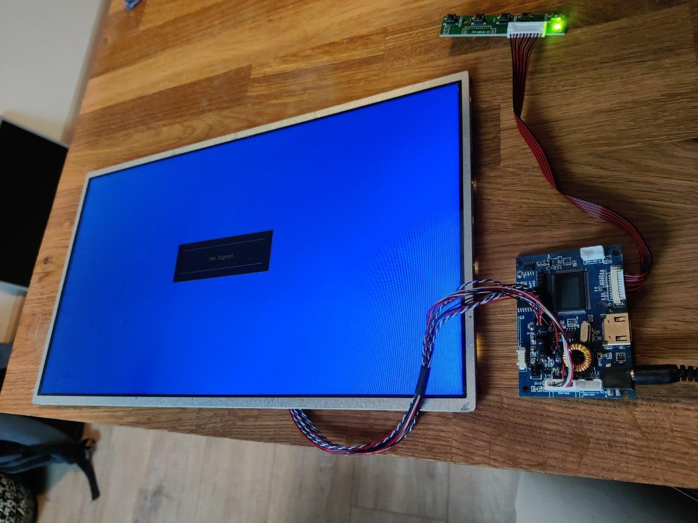

J'ai décidé de revoir mon link:/articles/mirint-v1[miroir intelligent] pour plusieurs raisons :

 - J'ai domotisé ma maison, et avoir un affichage des différents capteurs serait vraiment un plus
 - La page web affichée était fait à la main, alors que des solutions bien plus jolies existent comme https://magicmirror.builders/[MagicMirror^]
 - Le miroir était beaucoup trop épais, il sortait du mur d'une 10aine de centimètres
 - Il était moche
 - Il était beaucoup trop lourd, impossible de l'installer sur un mur sans mettre 1 ou 2 chevilles
 - L'écran mettait trop de temps à s'allumer, c'est dommage pour quelque chose qui doit donner des informations de manière spontanée de prendre 10 secondes les afficher
 - Autre chose qui en découle, mais on pouvait laisser l'écran allumer, mais il consommait beaucoup trop

Pour toutes ces raisons, j'ai décidé de le démonter pour en faire une nouvelle version.

== Matériel

=== Ecran

Je ne garderais par l'écran car c'est la principale raison pour laquelle le miroir n'était pas satisfaisant. Comme c'est une ancienne télévision, tout était prévu pour avoir de l'espace derrière l'écran et que celle-ci soit posée sur un meuble. On peut le voir notamment avec les ports HDMI qui sont à la perpendiculaire de la dalle, son épaisseur et son poids.

J'ai réussi à récupérer un écran LCD d'un ordinateur portable et j'ai commandé une carte d'aquisition pour le modèle de l'écran de ~13€ qui fera l'interface entre la sortie HDMI du Rapsberry Pi et la dalle LCD. Le principal intérêt de récupérer un écran comme celui-ci est qu'il a été prévu pour ne pas consommer car étant à l'origine dans un appareil mobile, que son poids et son épaisseur est vraiment faible et que cela permet de déporter la dite carte où on peut pour économiser encore une fois de l'espace et réduire l'épaisseur du miroir.

L'autre intérêt est le temps pour s'allumer. Il est quasi immédiat, c'est ainsi que sont utilisés les écrans d'ordinateurs portables. Vous verrez rarement un ordinateur mettre 10 secondes à s'allumer lorsque vous le sortez de veille, ou alors c'est votre OS qui prend son temps et non l'écran.

Et enfin la sécurité : je suis toujours plus à l'aise quand je ne travaille pas avec des tensions mortelles. Aussi, l'écran LCD et sa carte sont alimentés en 12V, ce qui permettra de sortir l'alimentation hors du miroir. Il faudra néanmoins prévoir un abaisseur de tension pour alimenter le Raspberry Pi en 5V.

=== Raspberry Pi

> Parlons du Raspberry Pi. Il s'avère que je pensais avoir un Raspberry Pi 2, mais en fait c'est le premier modèle. Il est donc extrêmement lent, il n'a clairement pas les reins pour produire un affichage rapide qui pourrait avoir des animations fluides. Aussi, il faudra que je change ce composant, il n'est pas approprié. Pour le moment, j'ai rien d'autre sous la main, et donc je l'utilise comme navigateur avec MagicMirror hébergé à un autre endroit. Dans la suite, je ferais comme si MagicMirror était hébergé sur le Raspberry Pi

Le Raspberry Pi va héberger le logiciel qui va nous permettre de facilement intégrer différents modules pour avoir l'affichage le plus complet possible : https://magicmirror.builders/[MagicMirror^]. C'est un logiciel spécialement conçu ce qu'on veut faire. Vous pouvez rajouter des plugins pour avoir toute sorte d'information sur l'écran. Comme tout côté logiciel a été fait, on ne va pas beaucoup aborder la configuration de MagicMirror hormis le fait d'avoir une installation fonctionnelle.

