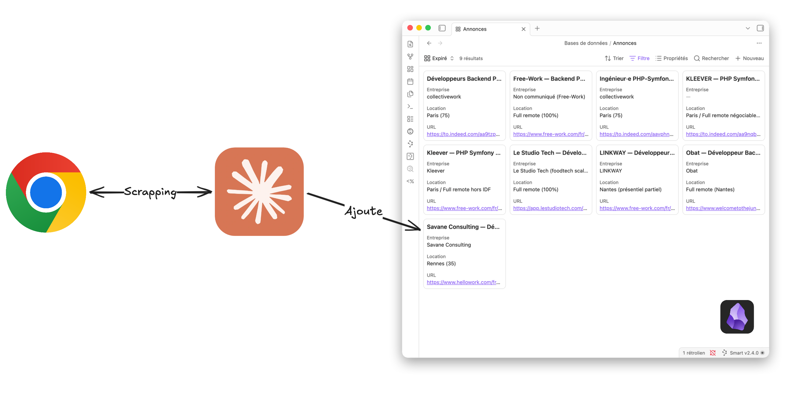

Au moment où j'écris ces lignes, je suis à la recherche d'une mission après mon congé parentalité. Et c'est... long et fastidieux. Je ne rentrerai pas dans les détails, mais des missions où on doit faire 5 métiers pour un salaire pas fou, du présentiel quasi-obligatoire sans trop de raison ou tout simplement les recruteurs qui ghost, c'est nul de chercher un taf. +
Un truc qui serait fun, ça serait de trouver un joujou avec lequel jouer, qui pourrait vaguement justifier de passer du temps pour faire de la montée en compétences, qui permettrait d'automatiser des choses car je suis un nerd, et qui me donnerait un peu plus de motivation à être assidu à cette tâche.

Vous savez ce que c'est des annonces de recrutement ? Du langage naturel. Vous savez ce qui est à la mode ? Les modèles de langage naturel. Bon, c'est plutôt évident. On ne veut pas un enième chatbot, on veut juste un truc qui nous trouve les annonces et prépare le terrain pour qu'on puisse faire autre chose de notre vie que réactualiser Indeed.

On se définit quelques objectifs histoire de ne pas partir dans tous les sens :

* Extraire des informations d'un CV
* Faire des critiques du CV
* Chercher des annonces pour le candidat
* Stocker ces annonces proprement
* Ne pas reproposer les annonces déjà vues ou traitées
* Générer des lettres de motivation adaptées aux annonces

== La stack technique

Je pense que c'est important à détailler. C'est pas réellement des prérequis, mais voyez plus ça comme des briques qui font partie de ma stack de recherche. +
Il nous faut donc une IA, un navigateur Web pilotable "crédible" (je reviendrai là-dessus plus tard) et une interface sympa pour visualiser les résultats et interagir avec. Certains vous diront de dire à l'IA de créer un site, moi je suis partisan d'utiliser ce qui existe et fonctionne bien sans avoir à gérer un side project dans le side project.

Donc on part sur **Claude** pour l'IA, **Chrome** pour le navigateur et **Obsidian** pour l'interface (un genre de Notion).

Chrome est relié à Claude via les utilitaires proposés par Claude et notamment Cowork. Obsidian quant à lui est lié à Claude via le MCP link:https://github.com/bitbonsai/mcpvault[MCP Vault].

== Préparons notre petite IA

On va utiliser un skill. C'est un fichier Markdown qu'on donne à Claude pour lui expliquer comment se comporter dans un contexte précis. Pas de code, pas d'infra, juste des instructions en langage naturel, des références à des fichiers, et quelques règles métier. C'est vraiment juste des guidelines, et je ne l'ai pas vraiment écrit moi-même finalement car l'IA le fait pour nous. L'œuf, ou la poule en premier ?

Mon skill `job-coach` ressemble à ça :

[source]
----
job-coach/
├── SKILL.md                         ← les instructions principales
└── references/
    ├── candidate-profile.md         ← le profil du candidat
    ├── cover-letter-guidelines.md   ← règles de rédaction des lettres
    └── job-sites.md                 ← les sites d'annonces
    ├── persistence.md               ← gestion de la mémoire
----

On va détailler chaque fichier, parce que c'est là que la magie opère (enfin, la "magie", c'est du texte dans des fichiers Markdown, faut pas s'emballer).

=== link:skill/SKILL.md[SKILL.md] — Le cerveau

C'est le fichier principal. Il contient le *frontmatter* qui décrit quand le skill doit se déclencher, et les instructions qui expliquent à Claude comment se comporter. On y définit les **workflows** : analyse de CV, recherche de missions, analyse d'une annonce, rédaction de lettre de motivation, historique des candidatures. +
Chaque workflow a ses déclencheurs (des phrases typiques qu'on pourrait dire à Claude) et ses étapes. C'est assez naturel finalement, on lui dit "quand je te dis *trouve-moi des missions*, voilà ce que tu fais".

Le frontmatter ressemble à ça :

[source,yaml]
----
---
name: job-coach
description: >
  Assistant personnel à l'embauche et coach en recherche d'emploi.
  À utiliser dès que l'utilisateur mentionne une offre d'emploi,
  une annonce, une lettre de motivation, une candidature, ou demande
  de trouver des missions.
---
----

La description est importante : c'est elle qui permet à Claude de savoir **quand** activer le skill. Si vous dites "trouve-moi des missions", Claude va lire cette description et se dire "ah oui, c'est pour moi ça". En gros ça permet que l'utilisation du skill soit faite par Claude au fil de la conversation sans avoir besoin explicitement de lui demander de l'invoquer.

Ensuite, le corps du fichier liste les workflows avec un format simple : déclencheur → étapes → références aux fichiers. On précise aussi l'ordre de priorité pour accéder aux sites web : d'abord Chrome (parce qu'on est déjà connecté), puis `web_fetch` en fallback, puis `web_search` pour de la découverte.

=== link:skill/references/candidate-profile.md[candidate-profile.md] — Le CV du candidat

Celui-là est presque vide au départ, et c'est voulu. L'idée c'est qu'on donne notre CV à Claude (en PDF, en texte, comme on veut) et il extrait les informations pertinentes pour les stocker dans ce fichier. Ça lui sert ensuite de référence pour comparer notre profil avec les annonces, sans avoir à relire le CV à chaque fois.

C'est aussi là que Claude peut noter les points faibles qu'il a identifiés, les compétences clés, le type de missions recherchées. Bref, c'est la mémoire du candidat.

IMPORTANT: Lors de la première utilisation, il faut demander à Claude de compléter ce fichier dans le skill en lui fournissant votre CV.

=== link:skill/references/cover-letter-guidelines.md[cover-letter-guidelines.md] — Les règles de rédaction

Parce qu'une lettre de motivation générée par IA, c'est souvent reconnaissable. Quand on voit des tirets longs (vous savez le faire de votre clavier ?!), des "Je suis votre plus grand fan" pour une entreprise qu'on ne connaît pas, sans parler des "La qualité fait partie de mon quotidien et est ma mission", on se dit que soit le candidat est un fayot, soit l'IA s'est enflammée !

Donc on la modère avec des règles claires :

* **Ton chaleureux mais pas trop enthousiaste** — on parle à un humain, pas à un jury de concours
* **Formulations interdites** — le tiret long "—", "passionné", "dynamique", "fait partie de mon quotidien" (cliché absolu)
* **Contenu ciblé** — on met en valeur ce qui correspond PRÉCISÉMENT à l'annonce, pas un résumé générique du CV
* **Structure courte** — accroche, profil, points différenciants, mot de fin, coordonnées. Maximum une page, idéalement 3-4 paragraphes

On y met aussi des règles sur la localisation : si c'est du remote on le mentionne positivement, si c'est sur place on dit qu'on est flexible. Le but c'est que la lettre ait l'air d'avoir été écrite par un humain qui a lu l'annonce, pas par un robot qui a fait du remplissage.

NOTE: C'est peut-être la principale cause d'édition du Skill. C'est vraiment itératif : à chaque fois qu'il va dans le mur, on lui décrit comment ne plus recommencer. Donc ne pas hésiter à lui dire de modifier le skill, encore et encore.

=== link:skill/references/job-sites.md[job-sites.md] — Où chercher

C'est la liste des sites d'annonces avec les stratégies d'accès. On y met les URLs, les notes sur l'authentification requise, et surtout les mots-clés de recherche recommandés. C'est un peu des guidelines pour expliquer où chercher, et comment. Ce document est très générique, il mériterait probablement d'être un peu affiné.

Un point important : on insiste sur le fait que les liens sauvegardés doivent pointer vers **la page de l'annonce elle-même**, jamais vers une page de résultats de recherche. Ça paraît évident, mais l'IA a tendance à s'emmêler les pinceaux et donne des URL un peu claquées comme celle d'une recherche globale.

On privilégie toujours le MCP au scraping, pour éviter les protections anti-bots mais aussi pour des raisons de performance. Pour le moment, je n'ai trouvé qu'Indeed qui avait un MCP, les autres ne sont accessibles que via le web scraping.

Mais pourquoi on ne laisserait pas l'IA choisir ses sites toute seule ? Le souci c'est qu'on lui en demande beaucoup, et moins on cadre les choses, plus elle peut partir YOLO style. L'idée est de la guider (gentiment) avec une liste plutôt riche de sites d'annonces pour qu'elle itère. Si on lui donne rien, elle pourrait très bien s'arrêter au premier site qu'elle rencontre en disant que sur terre, il n'existe aucune annonce. Ou alors elle pourrait passer 3 jours à scraper le monde entier. +
À ce sujet, rien n'empêche de faire un prompt à part pour lui demander de modifier le skill et d'affiner les listes sur lesquelles chercher.

=== link:skill/references/persistence.md[persistence.md] — La mémoire

Il définit comment et où stocker les annonces trouvées. On utilise Obsidian, un outil de notes en Markdown qui permet de faire des bases de données. Le principal avantage par rapport à Notion c'est qu'il reste extrêmement simple dans son système de stockage, ce qui coûte moins à l'IA d'interagir avec. De plus, tout est modifiable, ce ne sont que des fichiers textes. Le principe KISS en programmation s'applique ici : Keep It Stupid Simple. +
On stocke tout dans un tableau d'annonces : titre du poste, entreprise, URL, lieu, statut, description, note de pertinence sur 100, et lettre de motivation.

L'algorithme de traitement est simple :

. L'URL est déjà connue ? → On passe
. On rédige la lettre de motivation
. On ajoute la ligne dans le tableau avec le statut "Nouveau"

Et surtout, on définit des **droits d'accès stricts** : Claude peut lire le tableau et créer de nouvelles lignes, mais **jamais modifier ou supprimer** une ligne existante. C'est un petit garde-fou pour éviter que l'IA s'amuse à aller modifier ce que l'utilisateur a potentiellement édité de lui-même. Après, si vous lui demandez de modifier une annonce déjà présente, l'IA le fera tout de même.

== Chrome, et pourquoi pas un headless

Petite parenthèse sur le choix de Chrome plutôt qu'un navigateur headless type Puppeteer ou Playwright. +
Les sites d'annonces sont de plus en plus agressifs sur la détection de bots. Un navigateur headless, même bien configuré, se fait repérer assez vite : pas de cookies de session, pas d'historique, des fingerprints suspects. Tout cela provoque généralement des captchas, ce qui forcerait l'utilisateur à en résoudre tout un tas à chaque lancement.

Avec Chrome piloté via le MCP "Claude in Chrome", on utilise **notre vrai navigateur** avec nos vrais cookies, notre vrai historique, nos vraies sessions. Pour le site, c'est indiscernable d'un humain qui navigue. Et comme on est déjà connecté à LinkedIn, Indeed, Free-Work et compagnie, on a accès au contenu complet sans friction.

C'est pas parfait (ça nécessite que Chrome soit ouvert, c'est pas parallélisable facilement), mais pour un usage personnel c'est largement suffisant et bien plus fiable. Si jamais il y a une autre option, ça serait super !

== En pratique

En premier lieu, comme on disait, il faut absolument donner le profil du candidat. Simplement lui demander de l'ajouter dans les informations du candidat en modifiant le skill et en joignant le CV le plus complet du candidat.

Puis, on lance Claude et on lui dit :

____
Trouve-moi des missions
____

Et là, on le laisse bosser et on observe la magie. Claude alors :

. Lit le profil du candidat pour savoir ce qu'on cherche
. Consulte le tableau Obsidian pour voir ce qui a déjà été traité
. Navigue sur les sites d'annonces via Chrome
. Pour chaque annonce pertinente et pas encore vue, rédige une lettre de motivation et l'ajoute au tableau
. Nous présente un résumé des nouvelles trouvailles, triées par pertinence

On peut aussi coller une URL d'annonce et demander "est-ce que ça me correspond ?", ou dire "écris-moi une lettre de motivation pour cette annonce". Le skill gère les différents cas.

Le tableau Obsidian devient notre tableau de bord central : on y retrouve toutes les annonces avec leur note, leur lettre, leur statut. On peut trier, filtrer, marquer comme "En cours" ou "Refusé". L'IA remplit, nous on décide.

== Les limites

Il y a pas mal d'itérations avant d'arriver à une solution convenable.

* **La qualité des lettres** dépend beaucoup de la qualité des guidelines. Il faut itérer, relire, ajuster les règles. Les premières lettres étaient trop génériques, il a fallu ajouter des formulations interdites et insister sur le ciblage précis.
* **C'est pas temps réel**. On lance la recherche quand on veut, c'est pas un daemon qui tourne en fond. Mais franchement, deux fois par jour ça suffit largement, en début et en fin de journée par exemple. J'avoue, je le lance 3 à 4 fois par jour car je bidouille pas mal.

== Les améliorations

En soi il y en a tout le temps. J'itère énormément pour ajuster les règles. Et probablement que si on exporte ce skill sur un autre domaine que la recherche de missions Freelance en développement, il se planterait complètement. Mais l'idée est là et est dispo à tout le monde pour bidouillage.

Aussi, j'aimerais bien que le skill soit plus agnostique, et que le profil du candidat et les guidelines soient plutôt stockés dans Obsidian. Cela permettrait de forcer la décorrélation du skill avec le candidat (càd moi présentement), de pouvoir facilement corriger des informations manquant de précision ou mal extraites, mais aussi de pouvoir appliquer des guidelines personnalisées pour la lettre de motivation pour le candidat spécifiquement.
