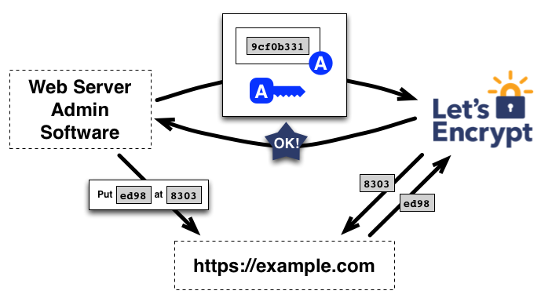

La certification locale est très utile majoritairement pour du développement local.
Il s'agit de fournir un certificat pour chaque domaine hébergé sur la machine, et que la fameuse page vous disant que le site est dangereux disparaisse.

== Comment fonctionne un certificat

Tout d'abord, un certificat sert à garantir l'authenticité d'un site par l'intermédiaire une autorité de confiance abrégée CA pour Certification Authority.
Je vais faire un exemple.

Je souhaite certifier que le site `blog.nicolasguilloux.eu` est à moi auprès d'un CA (par exemple link:https://letsencrypt.org/fr/[Let's Encrypt^]). Il va alors se passer plusieurs choses successivement :

1. Je créé un couple de clé privée et clé publique.
2. Je demande au CA de me donner un challenge pour qu'il vérifie que je contrôle bien l'adresse en question
3. Généralement, c'est un texte que l'on doit fournir à une URL précise (par exemple mettre le texte `ed98` dans l'URL https://blog.nicolasguilloux.eu/8303) et de le signer avec ma clé privée.
4. Le CA vérifie alors que le challenge est OK en déchiffrant le contenu de ladite page avec la clé publique qu'on lui fournit.
5. Le CA enregistre alors cette clé publique et la fournie à qui veut vérifier la certification du site `blog.nicolasguilloux.eu`

Ainsi, une personne lambda qui accède au site demande la clé publique au CA et vérifie le certificat fourni par le site avec chaque requête HTTPS avec celle-ci pour vérifier que je suis bien le propriétaire du site.

Pour plus d'information, vous pouvez consulter la link:https://letsencrypt.org/fr/how-it-works/[documentation^] de Let's Encrypt. L'image précédente est d'ailleurs tirée de cette page.

== Notre certification custom

Quand on demande une page https sans fournir de certificat, notre navigateur nous met en garde que ce n'est pas sécurisé, car il ne peut pas vérifier la source des informations données.
On va donc y remédier en créant un certificat par nous même, et en disant au système que l'autorité de confiance que nous avons créée est justement de confiance.

On remarque qu'on ne s'occupera pas de la partie challenge, qui est uniquement là pour que le CA nous croit notre légitimité. Ici, on est légitime, on détient de le système. Et le CA, c'est nous, on fait ce qu'on veut !

On va créer une dérivation qui va générer les certificats grâce à la liste des domaines qu'on lui aura fournis ainsi que l'éventuelle autorité de certification qu'on lui aura donné.

[source,nix]
----
{ stdenv
, mkcert
, domains ? [ "local" "*.local" ]
, authority ? null
}:

let
  domainsToString = builtins.concatStringsSep " " (
    builtins.map (domain: "\"${domain}\"") domains
  );
in
stdenv.mkDerivation rec {
  name = "local-certificates";
  dontUnpack = true;

  installPhase = ''
    # Create the directories
    mkdir -p $out/ssl/authority;
  '' +
    if authority != null then
      "cp ${authority} $out/ssl/authority/rootCA.pem"
    else
      ""
  + ''
    # Generate the certificates
    CAROOT="$out/ssl/authority" \
      ${mkcert}/bin/mkcert \
      -cert-file $out/ssl/local-cert.pem \
      -key-file $out/ssl/local-key.pem \
      ${domainsToString}
  '';
}
----

== L'intégration dans le système

Regardons maintenant son intégration dans la configuration générale de NixOS.

[source,nix]
----
{ config, lib, pkgs, ... }:

let
  localCerts = pkgs.callPackage ./local-certs.nix {
    domains = config.networking.hosts."127.0.0.1";
    # authority = ./rootCA.pem;
  };
in
{
  # Add certificates systemwide
  security.pki.certificateFiles = [
    (localCerts + "/ssl/authority/rootCA.pem")
  ];

  # Add local certificates
  services.traefik.dynamicConfigOptions.tls = {
    certificates = [
      {
        certFile = "${localCerts}/ssl/local-cert.pem";
        keyFile = "${localCerts}/ssl/local-key.pem";
      }
    ];

    stores.default.defaultCertificate = {
      certFile = "${localCerts}/ssl/local-cert.pem";
      keyFile = "${localCerts}/ssl/local-key.pem";
    };
  };
}
----

On peut déjà constater que je build la dérivation précédemment mentionnée afin de pouvoir l'exploiter ensuite. Comme domaine, je donne tous ceux qui renvoient vers mon localhost. Je brasse large, mais c'est plus simple ainsi.

On remarque aussi que j'ai commenté le `authority`. Si vous avez déjà créé l'autorité, vous pouvez l'utiliser sinon une sera créée pour vous. Cependant, cela peut poser problème si vous ne redémarrez pas entièrement votre système. En effet, si par exemple vous lancez Chrome, celui-ci récupèrera les autorités de votre système lors du démarrage. Ainsi, si les certificats locaux sont reconstruits, l'autorité aussi et Chrome n'aura pas la nouvelle autorité tout juste créée, du moins jusqu'à son prochain redémarrage.

On remarque donc qu'on ajoute le `rootCA.pem` dans les autorités du système. Ainsi, le système croira tous les certificats émis par cette autorité, c'est-à-dire la notre.

En prime, j'ai ajouté une configuration pour dire à Traefik d'associer le certificat généré par défaut. C'est un exemple et certaines personnes pourraient vouloir l'implémenter autrement.

== Et voilà !

Vous avez dorénavant une certification locale qui se régénère dès que vous ajoutez un site dans vos hosts.
